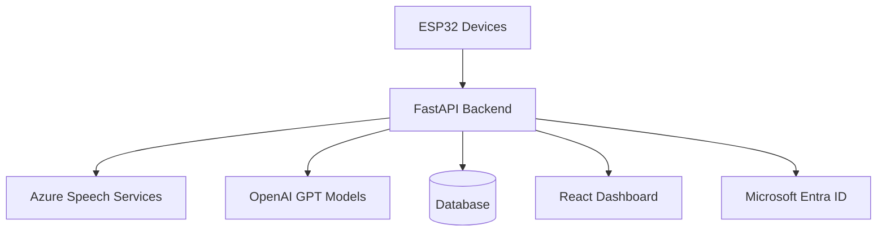

# Root Module Documentation

## Overview

The **root module** contains the main application files for MeetMind, an AI-powered meeting intelligence platform. This module implements a distributed IoT architecture that captures audio/video data from ESP32 devices, processes it through Azure AI services, and provides real-time insights through a web dashboard.

## Architecture



## Core Components

### 1. Main Application (`main.py`)

The primary FastAPI application that orchestrates the entire platform.

**Key Features:**
- FastAPI web server with CORS configuration
- Microsoft Entra ID authentication
- WebSocket support for real-time updates
- Audio/video file upload endpoints
- Meeting management API

**Usage Example:**
```bash
uvicorn main:app --host 0.0.0.0 --port 8000
```

### 2. AI Processing Engine (`ai_engine.py`)

Handles all AI-related operations including speech recognition, diarization, and content analysis.

**Key Functions:**
- `get_openai_client()` - Initialize OpenAI client
- `_ensure_wav_format()` - Convert audio to proper WAV format
- `_parse_iso_duration()` - Parse ISO 8601 duration strings

**Usage Example:**
```python
from ai_engine import get_openai_client

client = get_openai_client()
if client:
    response = client.chat.completions.create(
        model="gpt-3.5-turbo",
        messages=[{"role": "user", "content": "Analyze this meeting transcript..."}]
    )
```

### 3. Database Layer (`database.py`)

Provides database abstraction with support for both Azure SQL and SQLite with Azure Blob persistence.

**Configuration:**
- **Azure SQL**: For production deployments
- **SQLite + Blob Storage**: For development/testing

**Usage Example:**
```python
from database import SessionLocal, engine
import models

# Create tables
models.Base.metadata.create_all(bind=engine)

# Get database session
with SessionLocal() as db:
    # Perform database operations
    pass
```

### 4. Data Models (`models.py`)

SQLAlchemy ORM models for data persistence. See [Models Documentation](models.md) for complete schema details.

**Main Model: Meeting**
```python
class Meeting(Base):
    __tablename__ = "meetings"
    
    id = Column(String(50), primary_key=True)
    filename = Column(String(255))
    file_path = Column(String(500))
    created_at = Column(DateTime)
    # Additional fields...
```

## Environment Configuration

### Required Environment Variables

```bash
# OpenAI Configuration
OPENAI_API_KEY=your_openai_api_key

# Azure Speech Services
AZURE_SPEECH_KEY=your_speech_key
AZURE_SPEECH_REGION=your_region

# Database (choose one approach)
AZURE_SQL_CONNECTION_STRING=your_connection_string
# OR use SQLite with blob storage
AZURE_STORAGE_CONNECTION_STRING=your_storage_connection

# Authentication
AZURE_CLIENT_ID=your_client_id
```

### Optional Environment Variables

```bash
# Application Insights
APPINSIGHTS_CONNECTION_STRING=your_insights_connection
APPINSIGHTS_INSTRUMENTATION_KEY=your_instrumentation_key

# CORS (development only)
CORS_EXTRA_ORIGINS=http://localhost:3000,http://localhost:8080

# Custom database container (SQLite mode)
DB_CONTAINER=custom-container-name
DB_BLOB_NAME=custom/path/database.db
```

## API Endpoints

### Authentication
- `POST /auth/validate` - Validate Entra ID tokens
- `GET /auth/me` - Get current user information

### Meeting Management
- `POST /meetings` - Create new meeting
- `GET /meetings` - List all meetings
- `GET /meetings/{id}` - Get specific meeting details
- `DELETE /meetings/{id}` - Delete meeting

### File Processing
- `POST /upload-audio` - Upload audio file for processing
- `POST /upload-video` - Upload video file for processing
- `GET /audio/{filename}` - Download processed audio file

### Real-time Features
- `WebSocket /ws` - Live meeting updates and notifications
- `GET /health` - Application health check endpoint

## Security Features

### Microsoft Entra ID Integration
- JWT token validation
- Multi-tenant support
- Role-based access control

### CORS Configuration
```python
_cors_origins = [
    "https://meetmind.app",
    "https://www.meetmind.app",
    "https://stt-premium-app.mangoisland-7c38ba74.centralindia.azurecontainerapps.io"
]
```

## Deployment

### Azure Container Apps
The application is optimized for Azure Container Apps deployment with:
- Automatic scaling based on demand
- Container isolation and security
- Integrated monitoring and logging

### Docker Configuration
```dockerfile
FROM python:3.9-slim

WORKDIR /app

COPY requirements.txt .
RUN pip install --no-cache-dir -r requirements.txt

COPY . .

EXPOSE 8000

CMD ["uvicorn", "main:app", "--host", "0.0.0.0", "--port", "8000"]
```

## Monitoring & Telemetry

### Application Insights Integration
When `APPINSIGHTS_CONNECTION_STRING` is configured, the application automatically collects:
- HTTP request/response metrics
- Dependency call tracking
- Custom business metrics
- Exception and error logging

## Error Handling

### Common Error Patterns
```python
# API key validation
if not api_key:
    logger.warning("OpenAI API key not configured")
    return None

# Database connection handling
try:
    # Database operations
    pass
except SQLAlchemyError as e:
    logger.error(f"Database error: {e}")
    raise HTTPException(status_code=500, detail="Database operation failed")
    
# Blob storage error handling
except BlobServiceError as e:
    logger.error(f"Blob storage error: {e}")
    return None
```

## Performance Considerations

### Database Optimization
- Connection pooling for Azure SQL connections
- In-memory SQLite with blob persistence for development
- Automatic cleanup of old meeting recordings

### Audio Processing
- Efficient WAV format conversion using FFmpeg
- Chunked file processing for large recordings
- Background task processing for time-intensive operations

## Development Setup

1. **Install Dependencies**
   ```bash
   pip install -r requirements.txt
   ```

2. **Configure Environment**
   ```bash
   cp .env.example .env.secrets
   # Edit .env.secrets with your API keys and configuration
   ```

3. **Run Development Server**
   ```bash
   uvicorn main:app --reload --host 0.0.0.0 --port 8000
   ```

4. **Access API Documentation**
   - Swagger UI: http://localhost:8000/docs
   - ReDoc: http://localhost:8000/redoc

## Cross-References

- [AI Engine Documentation](ai_engine.md) - Detailed AI processing workflows
- [Database Schema](models.md) - Complete data model documentation
- [API Reference](api_reference.md) - Full endpoint documentation
- [Deployment Guide](deployment.md) - Production deployment instructions

## Best Practices

- **Environment Variables**: Always validate required environment variables at startup
- **Background Tasks**: Use FastAPI background tasks for long-running operations
- **Error Handling**: Implement comprehensive error handling with proper HTTP status codes
- **Authentication**: Follow OAuth 2.0 best practices for token validation
- **Monitoring**: Enable Application Insights in production for observability
- **Resource Management**: Monitor memory and CPU usage for audio processing workloads